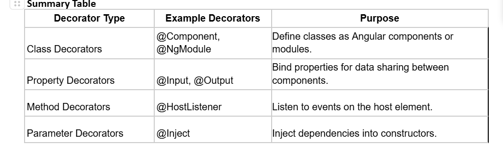

# Angular-Preparation2025

>  ## What are decorators ?
> Angular decorators are special functions that attach metadata to classes, methods, properties, or parameters. This metadata guides Angular on how to process and instantiate these elements. Decorators are fundamental in Angular for defining components, services, directives, and more.

>  ## Types of Angular Decorators
> Angular provides four main types of decorators:
> Class Decorators
> Property Decorators
> Method Decorators
> Parameter Decorators

>  ## Class Decorators
> Class decorators are applied to classes to define their purpose within Angular. Common class decorators include @Component, @Directive, @NgModule, and @Injectable

>  ## Property Decorators
> Property decorators are applied to class properties to define their behavior. Common property decorators include @Input and @Output.
**Explanation:**
@Input() makes userName a property that can receive data from a parent component.
In the parent template, [userName]="'RaHuL PaTel'" passes the string 'Alice' to the child component.
**Output:**
**Displays: Welcome, RaHuL PaTel!**

>  ## Method Decorators
> Method decorators are applied to class methods to define their behavior. A common method decorator is @HostListener
**Explanation:**
@HostListener('document:click', ['$event']) listens for click events on the entire document.
Each time the document is clicked, onDocumentClick is called, incrementing clickCount.
**Output:**
**Displays:** Click anywhere to increase the count: X, where X increments with each click.

>  ## Parameter Decorators
> Parameter decorators are applied to constructor parameters to define how they are injected. 
A common parameter decorator is @Inject
**Explanation:**
@Inject(DOCUMENT) tells Angular to inject the Document object into the constructor.
this.document.title = 'Angular Decorators'; sets the browser tab's title.
**Output:**     
The browser tab title changes to: Angular Decorators Example.

