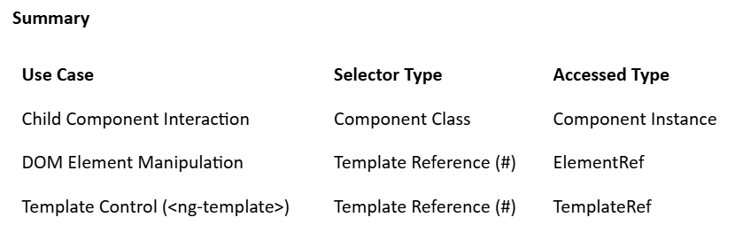

# Angular-Preparation2025

>  ## What are decorators ?
> Angular decorators are special functions that attach metadata to classes, methods, properties, or parameters. This metadata guides Angular on how to process and instantiate these elements. Decorators are fundamental in Angular for defining components, services, directives, and more.

>  ## Types of Angular Decorators
> Angular provides four main types of decorators:
> Class Decorators
> Property Decorators
> Method Decorators
> Parameter Decorators

>  ## Class Decorators
> Class decorators are applied to classes to define their purpose within Angular. Common class decorators include @Component, @Directive, @NgModule, and @Injectable

>  ## Property Decorators
> Property decorators are applied to class properties to define their behavior. Common property decorators include @Input and @Output. 
**Explanation:**
@Input() makes userName a property that can receive data from a parent component.
In the parent template, [userName]="'RaHuL PaTel'" passes the string 'Alice' to the child component. 
**Output:**
  

 > ### What is @ViewChild()?
 > In Angular, @ViewChild() is a decorator that allows a component to access a child component, directive,or DOM element from its own template.  
- This is particularly useful when you need to:  
	* Interact with a child component's properties or methods 
	* Access native DOM elements for direct manipulation
	* Control template elements like ng-template or ng-container  
**How Does @ViewChild() Work?**  
When you use @ViewChild(), Angular searches the component's template for the first element that 
matches the selector and assigns it to the specified property. This property becomes available after 
Angular initializes the component's view, typically in the ngAfterViewInit() lifecycle hook.
@ViewChild(ChildComponent) childComponent!: ChildComponent;

**Use Case 1: Accessing a Child Component's Method Scenario:**
You have a ChildComponent with a method that needs to be triggered from the ParentComponent. 
**Use Case 2: Accessing a Template Reference Variable Scenario:**
You want to access a DOM element directly to, for example, set focus or read its value. 
**Use Case 3: Controlling an <ng-template> Scenario:**
You have an ng-template that you want to render conditionally or manipulate programmatically. 
**Real-World Applications:**
Form Validation: Access form controls to set focus or display validation messages.
Modal Dialogs: Control the opening and closing of modals.
Dynamic Content: Render components or templates conditionally.
Third-Party Libraries: Integrate and control third-party UI components.  
   

>  ## Method Decorators
> Method decorators are applied to class methods to define their behavior. A common method decorator is @HostListener 
**Explanation:**
@HostListener('document:click', ['$event']) listens for click events on the entire document.
Each time the document is clicked, onDocumentClick is called, incrementing clickCount. 
**Output:**
**Displays:** Click anywhere to increase the count: X, where X increments with each click.  

>  ## Parameter Decorators
> Parameter decorators are applied to constructor parameters to define how they are injected. 
A common parameter decorator is @Inject 
**Explanation:**
@Inject(DOCUMENT) tells Angular to inject the Document object into the constructor.
this.document.title = 'Angular Decorators'; sets the browser tab's title. 
**Output:**     
The browser tab title changes to: Angular Decorators Example.  

   

